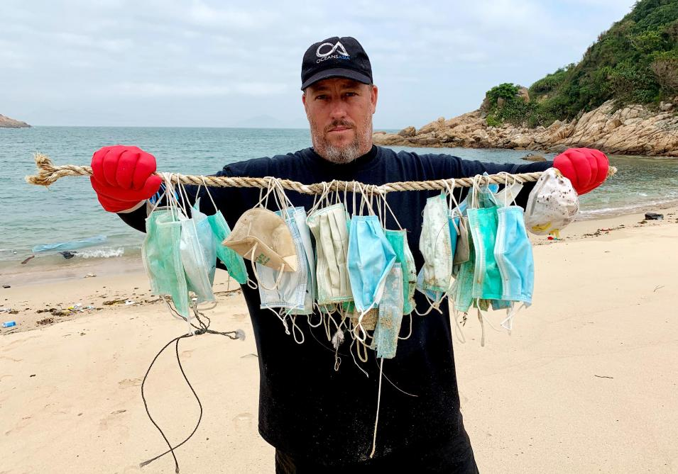

```{r setup, include=FALSE}
knitr::opts_chunk$set(echo = FALSE)
```
 

# Source of the article

Link of the article : <https://science.sciencemag.org/content/369/6509/1314>

I consulted this article on the 23 October 2020.

# Vocabulary

# Analysis table about the study

