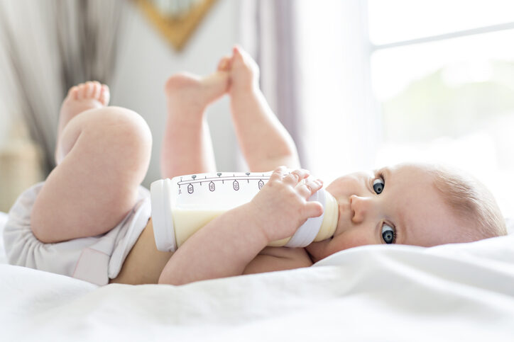

```{r setup, include=FALSE}
knitr::opts_chunk$set(echo = FALSE)
```



# Source of the article

Link of the article : <https://www.newscientist.com/article/2257599-plastic-baby-bottles-shed-millions-of-microplastics-when-shaken/> (19/10/2020)

Word count : 512

# Vocabulary

| Word from the text |                                                             Synonym/definition in English                                                             |    French translation     |
| :----------------: | :---------------------------------------------------------------------------------------------------------------------------------------------------: | :-----------------------: |
|       Infant       |                                                             A baby or a very young child.                                                             |    Bébé / Jeune enfant    |
|       Poured       | A substance was made to flow from a container, especially into another container, by raising just one side of the container that the substance is in. |           Versé           |
|       Mimic        |                     To copy the way in which a particular person usually speaks and moves, usually in order to make people laugh.                     |          Imiter           |
|      Leaking       |            (Of a liquid or gas) 
Escaping from a hole or crack in a pipe or container; (of a container) allowing liquid or gas to escape.             |         Fuyaient          |
|       Range        |                                                               A set of similar things.                                                                |           Gamme           |
|    Substantial     |                                                         Large in size, value, or importance.                                                          | Substantiel, considérable |
|   (daily) Intake   |                                                            The act of taking in something.                                                            |    Apport (quotidien)     |
|    For instance    |                                                                    As an example.                                                                     |        Par exemple        |

# Analysis about the study

## Researchers

John Boland at Trinity College Dublin in Ireland and his colleagues.

## Published in ? When ?

«Nature food» online journal (19/10/2020)

## General topic

Microplastics in plastic baby bottles.

## Procedure/what was examined

They examined the microplastics released during the process of preparing baby formula in feeding bottles made of polypropylene plastic (that’s about 69% of the feeding bottles available on the market).

1. They bought new feeding bottles which were cleaned, sterilised and allowed to dry.

2. Then, they were placed in purified water at 70°C (WHO recommends this temperature for the preparation of baby formula). After that they were placed in a mechanical shaker (to mimic the formula mixing process).

3. The team filtered the water and analysed it under a microscope.

## Conclusions/discovery

Plastic feeding bottles release an average of 4 million microplastic particles per litre into baby formula during preparation.

## Remaining questions 

They don’t know if ingesting microplastics is harmful to infant health or not.

