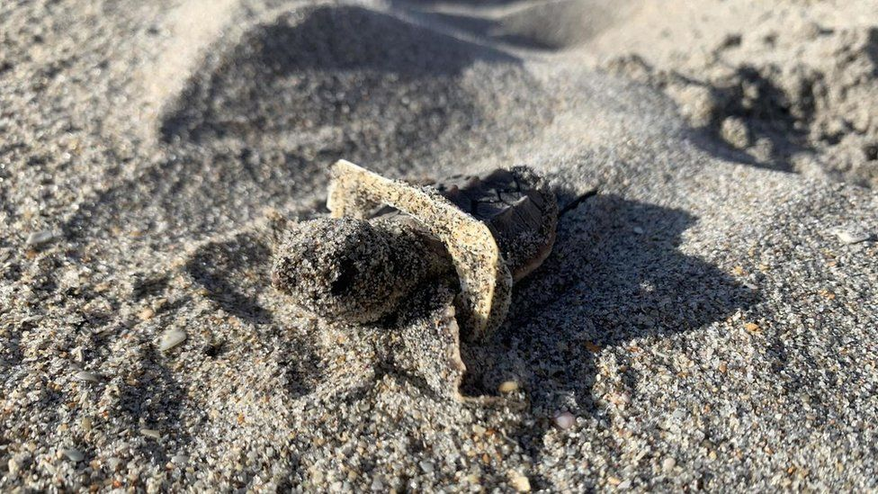

```{r setup, include=FALSE}
knitr::opts_chunk$set(echo = FALSE)
```




# Source of the article

Link of the article : <https://www.bbc.com/news/world-us-canada-55006333> (19/11/2020)

Word count : 466

# Vocabulary

|   Word from the text   |                               Synonym/definition in English                                |   French translation    |
| :--------------------: | :----------------------------------------------------------------------------------------: | :---------------------: |
|   Unfolding disaster   |                              Disaster which is taking place.                               | Désastre qui se déroule |
|      Decade-long       |                                Over a period of ten years.                                 |      Une décennie       |
| Comprehensive (report) |                       Including or dealing with all or most aspects.                       |   (rapport) détaillé    |
|       Threatened       |                                         Endangered                                         |         Menacés         |
|         Warns          |                Informs someone in advance of a possible danger or problem.                 |        Prévient         |
|       Monk seals       |                                      A type of seal.                                       |     Phoques moines      |
|     A grim picture     |                   Situation that is unpleasant and difficult to accept.                    |    Une image sombre     |
|        Authored        |                                           Wrote                                            |         Rédigé          |
|        Drowning        |                   Death caused by submersion in and inhalation of water.                   |         Noyade          |
|       Entangled        |                        Caught in something such as a net or ropes.                         |         Emmêlé          |
|       Sei whale        |                                      A type of whale.                                      |     Rorqual boréal      |
|        Curtail         |         To stop something before it is finished, or to reduce or limit something.          |         Réduire         |
|         Straws         | Thin tubes made of plastic or waterproof paper that is used to suck liquid into the mouth. |         Pailles         |
|      Bin lorries       |                                Rubbish collection vehicles.                                |    Camions poubelles    |

# Analysis about the study

## Researchers ?

Oceana, the world's largest ocean conservation group.
Author: Dr Kimberly Warner.

## Published in ? When ?

Oceana USA website (19/11/2020)

## General topic

Damage to the US marine life due to plastic pollution.

## Procedure / What was examined

The study tried to find out which marine animals are harmed by plastic pollution in US waters and offered solutions.

## Conclusions / Discovery

- Since 2009, they found 1,792 cases of marine animals injured due to plastic (entangled, injured when swallowing it, strangled, drowned,…).

- 88% of them were threatened or endangered. The study concerns about 40 species including Hawaiian monk seals, Florida manatees, Steller sea lions and all six species of sea turtle found in the US.

- The researchers are sure that the true numbers are definitely worse. 

- Plastic pollution is one of several human-caused factors endangering the planet.
-> Industries continue to increase our use of plastic. 
The US produces more single-use plastic than any other nation.

- 15 million metric tonnes of plastic enter the oceans each year.
It is going to tripe by 2040.

=> Oceana would like: 

- Companies tp reduce the amount of plastic produced and offer plastic-free alternatives. 

- Governments to investigate policies to help reduce single-use plastics.

## Remaining questions 

/

