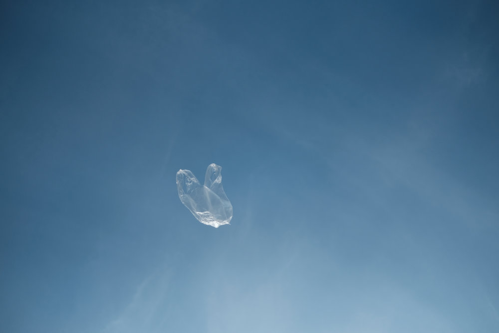

```{r setup, include=FALSE}
knitr::opts_chunk$set(echo = FALSE)
```


 


# Source of the article

Link of the article : <https://www.scientificamerican.com/article/thousands-of-tons-of-microplastics-are-falling-from-the-sky/> (11/06/2020)

Word count : 875

# Vocabulary

| Word from the text |                                          Synonym/definition in English                                           |  French translation   |
| :----------------: | :--------------------------------------------------------------------------------------------------------------: | :-------------------: |
|       Beads        |             A small, coloured, often round piece of plastic, wood, glass, etc. or a drop of liquid.              |        Perles         |
|      In dusts      | As fine dry powder consisting of tiny particles of earth or waste matter that covers surfaces inside a building. |   Dans les poussières |
|    From remote     |                                              Far away in distance.                                               |   A distance/apart    |
|     Discarded      |                                                  Thrown away.                                                    |        Ecarté         |
|    Sheer scale     |                                           The immensity of something.                                            | Ampleur du phénomène  |
|     Watershed      |                          An area of high ground from which water flows down to a river.                          |    Bassin versant     |
|        Lid         |                                             A cover on a container.                                              |      Couvercle        |
|        Gear        |                       The equipment, clothes, etc. that you use for a particular activity.                       |      Equipement       |
|     Astounded      |                                            Very surprised or shocked.                                            |        Etonné         |
|  The flight paths  |                                Routes followed by an aircraft/plastic particles.                                 | La trajectoire de vol |

# Analysis about the study

## Researchers ?

Janice Brahney, a watershed scientist at Utah State University (author) and her colleagues. 

## Published in ? When ?

Not mentioned

## General topic

Microparticles of plastics transported by the wind.

## Procedure / What was examined

The scientists examined how microplastics travel in the atmosphere locally and long-distance. They also showed the proportion of these particles in the dust. 

- During one year, they collected microplastics from 11 national parks and wilderness areas in the western U.S. 

They used a pair of buckets (one for dry weather and the other one for wet weather). The lid automatically closed using a sensor. It was weather dependent.

- In the lab : some scientists counted the microplastics under the microscope (they used dyes to separate the plastics particles clearly from other particles).

Others used Fourier transform infrared spectroscopy. This is a technique to measure how the samples absorbed and emitted infrared light. In this way it was possible to differentiate plastic from other materials.

## Conclusions / discovery

- In total, in the samples 4% of particles were plastic. The microplastics had different origins: carpeting, paint, cosmetic products, camping gear, clothing,…

- Wet microplastics -> heavy -> close to cities.

- Dry microplastics -> smaller and more numerous -> higher in the atmosphere, away from cities.

=> The microplastics are transported by the wind and carried far away. «More than 1,000 metric tons of microplastics fall on protected lands in the country’s western region each year ».

## Remaining questions 

The future research will focus on the question of: «How microplastics enter the atmosphere ?»

