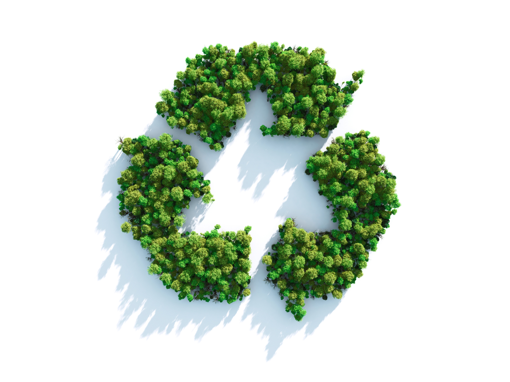

```{r setup, include=FALSE}
knitr::opts_chunk$set(echo = FALSE)
```

 

# Source of the article

Link of the article : <https://www.newscientist.com/article/2252265-a-new-type-of-plastic-may-be-the-first-that-is-infinitely-recyclable/> (19/08/2020)

Word count : 304

# Vocabulary

| Word from the text |                          Synonym/definition in English                          | French translation  |
| :----------------: | :-----------------------------------------------------------------------------: | :-----------------: |
|    For instance    |                                   For exemple                                   |     Par exemple     |
|       Tipped       |                           To pour something somewhere                           |      Déversés       |
|     To remould     |                              To reform in a mould                               |      Remouler       |
|      Benches       | A long, usually hard seat for two or more people, often found in public places. |        Bancs        |
|     Toughness      |          The quality of being strong and not easily broken or damaged.          |       Dureté        |

# Analysis about the study

## Researchers ?

Eugene Chen at Colorado State University and his colleagues 

## Published in ? When ?

Science advance (19/08/2020)

## General topic

Discovery of a new type of plastic infinitely recyclable.

## Procedure / What was examined


## Conclusions / discovery


## Remaining questions 

/
