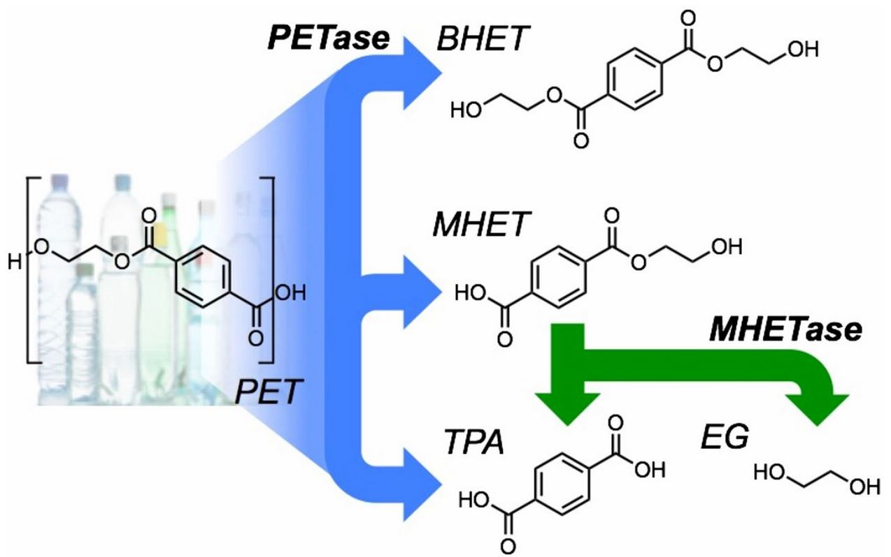

```{r setup, include=FALSE}
knitr::opts_chunk$set(echo = FALSE)
```




# Source of the article

Link of the article : <https://www.sciencedaily.com/releases/2020/09/200928152913.htm> (28/09/2020)

Word count : 713

# Vocabulary

| Word from the text |                                                                Synonym/definition in English                                                                 | French translation  |
| :----------------: | :----------------------------------------------------------------------------------------------------------------------------------------------------------: | :-----------------: |
|      Heralds       | To be a sign that something important, and often good, is starting to happen, or to make something publicly known, especially by celebrating or praising it. |       Annonce       |
|      Dwelling      |                                                                 A house or place to live in                                                                  |      Logement       |
|     To tackle      |                                                                To try to deal with something.                                                                |       Tacler        |
|       Chops        |                                         To cut something into pieces with an axe, knife, or other sharp instrument.                                          |       Couper        |
|     Mimicking      |                        To copy the way in which a particular person usually speaks and moves, usually in order to make people laugh.                         |       Imitant       |
|     Delighted      |                                                                         Very pleased                                                                         |        Ravie        |
|       Grasp        |                                                To quickly take something in your hand(s) and hold it firmly.                                                 |       Saisir        |
|     Littering      |                                      Small pieces of rubbish that have been left lying on the ground in public places.                                       |      Détritus       |
|      Reliance      |                                                The state of depending on or trusting in something or someone.                                                |     Dépendance      |
|     Blueprints     |                                                A complete plan that explains how to do or develop something.                                                 |        Plans        |
|   Computational    |                                                             Using computers to study something.                                                              |    Informatique     |

# Analysis about the study

## Researchers ?

The team was co-led by the scientists who engineered PETase, Professor John McGeehan, Director of the Centre for Enzyme Innovation (CEI) at the University of Portsmouth, and Dr Gregg Beckham, Senior Research Fellow at the National Renewable Energy Laboratory (NREL) in the US. 

## Published in ? When ?

Journal Proceedings of the National Academy of Sciences 

## General topic

Association between two enzymes that digest plastic.

## Procedure / What was examined

The PET is the most used plastic. The problem is that it takes a lot of time to decompose in the environment. So the scientists try to find out a solution. 

We already know that PET-ase enzyme can digests PET plastic but it takes too much time to use it. So they needed to find an other large scale solution to fight the plastic pollution.

At the first step, they discovered an other enzyme (MHET-ase) in the «natural» plastic littering. After that they made some experiments in laboratories and they found the molecular structure of the enzyme. Thanks to that they made a lot of researches on the function of this molecule and they were able to reproduce it synthetically.  

## Conclusions / Discovery

Finally they discovered that the combination of PET-ase and the MHET-ase was a «super-enzyme». It can digest plastic particules and cut it into theirs building blocks six times faster than the PET-ase alone.

=> It can help to reduce our plastic pollution and decrease the greenhouse gases. We could also recycle our plastic indefinitely with a low energy method and keep its primary quality. 

## Remaining questions 

/

