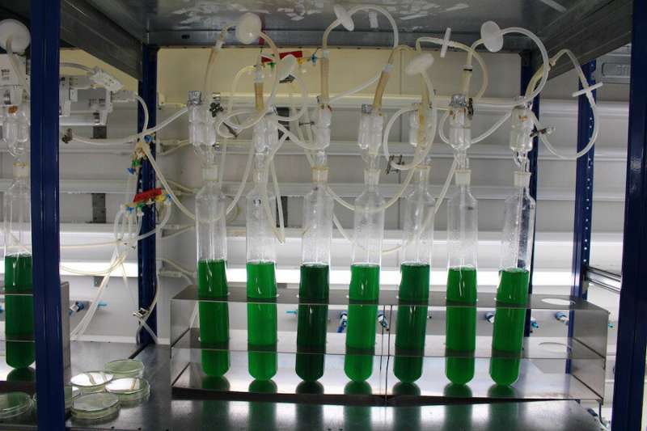

```{r setup, include=FALSE}
knitr::opts_chunk$set(echo = FALSE)
```




# Source of the article

Link of the article : <https://phys.org/news/2021-02-cyanobacteria-revolutionize-plastic-industry.html> (02/02/2021)

Word count : 538

# Vocabulary

| Word from the text |                                                              Synonym/definition in English                                                              | French translation  |
| :----------------: | :-----------------------------------------------------------------------------------------------------------------------------------------------------: | :-----------------: |
|      Enabling      |                                                          Making something possible or easier.                                                           |     Activation      |
|     Forecasts      | A statement of what is judged likely to happen in the future, especially in connection with a particular situation, or the expected weather conditions. |     Prévisions      |
|       Strain       |                An animal or plant from a particular group whose characteristics are different in some way from others of the same group.                |       Souche        |
|        Flow        |                      (especially of liquids, gases, or electricity) to move in one direction, especially continuously and easily.                       |       Couler        |
|    Implementing    |                                                             To start using a plan or system                                                             |      Exécution      |
|   Inconspicuous    |                                           Not easily or quickly noticed or seen, or not attracting attention.                                           |       Discret       |

# Analysis about the study

## Researchers ?

Professor Karl Forchhammer of the Interfaculty Institute of Microbiology and Infection Medicine and his researchers in the University of Tübingen.

## Published in ? When ?

Journals Microbial Cell Factories and PNAS (Proceedings of the National Academy of Sciences).

## General topic

Biological plastic produced by the cyanobacteria

## Procedure / What was examined


## Conclusions / Discovery


## Remaining questions 

/

