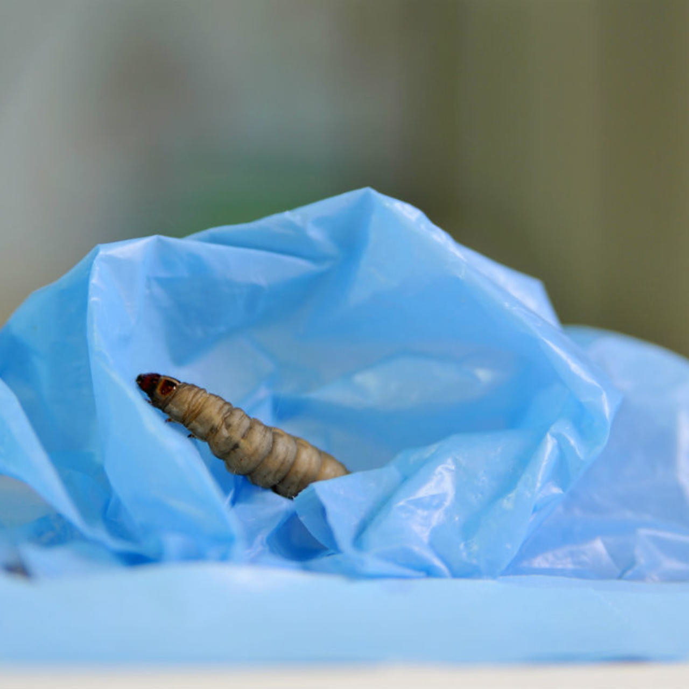

```{r setup, include=FALSE}
knitr::opts_chunk$set(echo = FALSE)
```




# Source of the article

Link of the article : <> ()

Word count :

# Vocabulary


# Analysis about the study

## Researchers ?


## Published in ? When ?


## General topic


## Procedure / What was examined

 

## Conclusions / Discovery


## Remaining questions 

/

